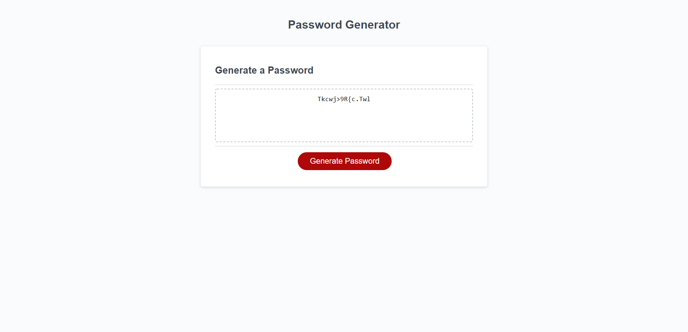

# Password Generator

## Description 
The goal of the project is to complete a password Generator that completes several requirements from the client

**The following problems are solved,**

-The button Generate password when pressed creats questions for the password criteria

-The criteria is then added to the password and a length is added.

-If no criteria is added an alert is shown and it restarts.

-Once completed the password is generated to the page

**Throught the project i learnt the following,**

-Using event listners

-Creating and implementing while loops

-Using functions

-Creating powerful if/for statements 

## Usage 
The following link is the completed active website.
https://pjoll.github.io/Password-Generator/

The following image shows the completed result.

